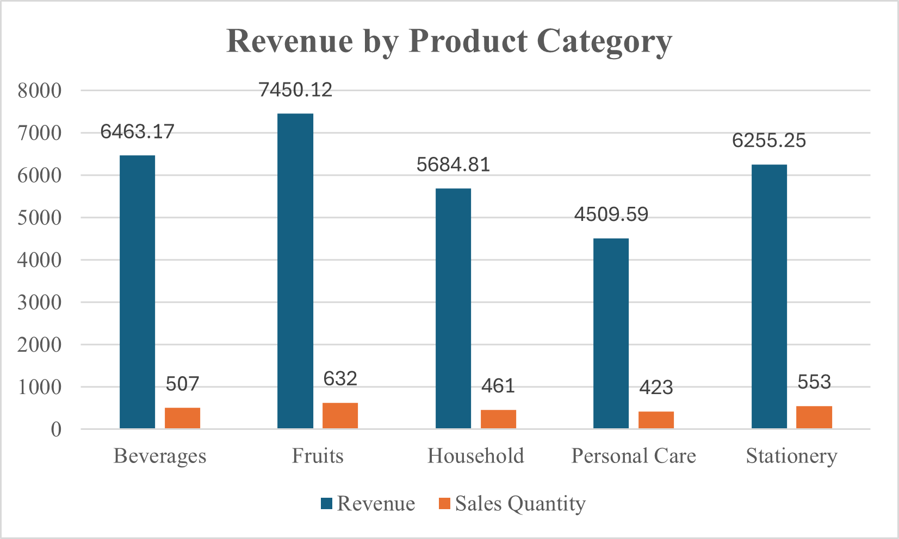
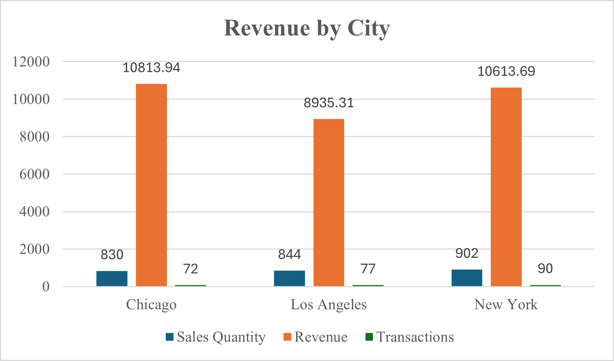

# MIS 311 - Supermarket Sales Analysis

## Project Overview
This project analyzes supermarket sales data to identify sales patterns across product categories and cities. The goal is to use exploratory data analysis to generate business insights that can support decisions related to inventory planning, sales strategy, and location-based business performance.

## Dataset Description
The dataset contains supermarket transaction records. It includes sale ID, branch, city, customer type, product name, product category, quantity sold, and total price.

## Tools Used
- Microsoft Excel
- PivotTable
- Descriptive Statistics
- Data Visualization

## Data Cleaning
The original dataset contained 253 transaction records and 8 columns. Missing values were found in customer_type, product_category, and quantity. Since the number of affected rows was small compared to the total dataset, rows with missing values were removed to maintain the accuracy of the analysis.

Duplicate rows were also checked using Excel’s Remove Duplicates function. Three duplicate records were found and removed because duplicated sales transactions could overstate total revenue and quantity sold. After cleaning, the final dataset contained 239 records.

## Descriptive Statistics
The cleaned dataset had total revenue of $30,362.94 and total quantity sold of 2,576 units. The average transaction value was $127.04, while the median transaction value was $106.59. The minimum transaction value was $2.18, and the maximum transaction value was $427.14.

## Visualizations

### FIGURE 1. Revenue by Product Category

### FIGURE 2. Revenue by City

## Key Insights

### Insight 1: Product Category Performance
Fruits generated the highest revenue at $7,450.12, accounting for approximately 24.5% of total sales revenue. This suggests that Fruits is the strongest product category in the supermarket and should receive strong inventory support to avoid stock shortages. In contrast, Personal Care generated the lowest revenue at $4,509.59, so the supermarket may need to review its promotion strategy, pricing, or product variety in this category.

### Insight 2: City Sales Performance
Chicago generated the highest revenue at $10,813.94, slightly higher than New York at $10,613.69 and Los Angeles at $8,935.31. Although New York had more transactions, Chicago produced higher total revenue, which suggests that customers in Chicago may have a higher average spending per transaction. The supermarket could study Chicago’s sales patterns to understand what drives stronger transaction value in that city.

## Conclusion
The analysis shows that supermarket sales performance varies by product category and city. Fruits was the top-performing product category, while Chicago generated the highest total revenue among the cities. These findings can help the supermarket improve inventory planning, product promotion, and city-based sales strategies.
